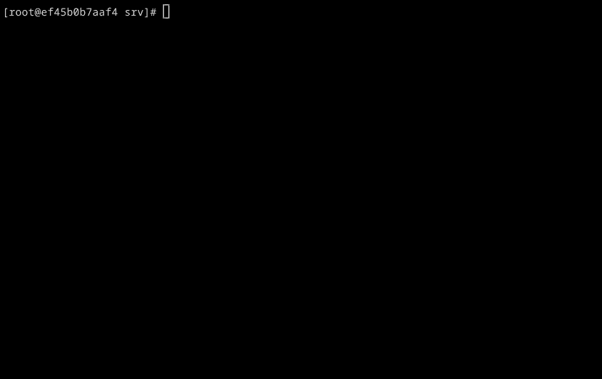

= Interscript: Interoperable Script Conversion Systems, with Ruby and JavaScript runtimes

image:https://github.com/interscript/interscript/workflows/test/badge.svg["Ruby build status", link="https://github.com/interscript/interscript/actions?workflow=test"]
image:https://github.com/interscript/interscript/workflows/js/badge.svg["JavaScript build status", link="https://github.com/interscript/interscript/actions?workflow=js"]

== Introduction

This repository contains interoperable transliteration schemes from:

* ALA-LC
* BGN/PCGN
* ICAO
* ISO
* UN (by UNGEGN)
* Many, many other script conversion system authorities.

The goal is to achieve interoperable transliteration schemes allowing quality comparisons.

== Demonstration

These transliteration systems are used in the demo:

`bgnpcgn-rus-Cyrl-Latn-1947`:: BGN/PCGN Romanization of Russian
`iso-rus-Cyrl-Latn-9-1995`::     ISO 9 Romanization of Russian
`icao-rus-Cyrl-Latn-9303`::    ICAO MRZ Romanization of Russian
`bas-rus-Cyrl-Latn-2017-bss`::      Bulgaria Academy of Science Streamlined System for Russian

== Installation

=== Prerequisites

Interscript depends on Ruby. Once you manage to install Ruby, it's easy. This part
won't work until we release Interscript v2, please use the one below.

[source,sh]
----
gem install interscript -v "~>2.0"
----

You can also download a local copy of this Git repository, eg. for development
purposes:

[source,sh]
----
git clone https://github.com/interscript/lcs
cd lcs/ruby
bundle install
----

==== Additional prerequisites for Thai systems

If you want to transliterate Thai systems, you will need to install some additional
requirements. Please consult: link:docs/Usage_with_Secryst.adoc[Usage with Secryst].

== Usage

Assume you have a file ready in the source script like this:

[source,sh]
----
cat <<EOT > rus-Cyrl.txt
Эх, тройка! птица тройка, кто тебя выдумал? знать, у бойкого народа ты
могла только родиться, в той земле, что не любит шутить, а
ровнем-гладнем разметнулась на полсвета, да и ступай считать версты,
пока не зарябит тебе в очи. И не хитрый, кажись, дорожный снаряд, не
железным схвачен винтом, а наскоро живьём с одним топором да долотом
снарядил и собрал тебя ярославский расторопный мужик. Не в немецких
ботфортах ямщик: борода да рукавицы, и сидит чёрт знает на чём; а
привстал, да замахнулся, да затянул песню — кони вихрем, спицы в
колесах смешались в один гладкий круг, только дрогнула дорога, да
вскрикнул в испуге остановившийся пешеход — и вон она понеслась,
понеслась, понеслась!

Н.В. Гоголь
EOT
----

You can run `interscript` on this text using different transliteration systems.

[source,sh]
----
interscript rus-Cyrl.txt \
  --system=bgnpcgn-rus-Cyrl-Latn-1947 \
  --output=bgnpcgn-rus-Latn.txt

interscript rus-Cyrl.txt \
  --system=iso-rus-Cyrl-Latn-9-1995 \
  --output=iso-rus-Latn.txt

interscript rus-Cyrl.txt \
  --system=icao-rus-Cyrl-Latn-9303 \
  --output=icao-rus-Latn.txt

interscript rus-Cyrl.txt \
  --system=bas-rus-Cyrl-Latn-2017-bss \
  --output=bas-rus-Latn.txt
----

It is then easy to see the exact differences in rendering between the systems.

[source,sh]
----
diff bgnpcgn-rus-Latn.txt bas-rus-Latn.txt
----

If you use Interscript from the Git repository, you would call the following command
instead of `interscript`:

[source,sh]
----
# Ensure you are in your Git repository root path
ruby/bin/interscript rus-Cyrl.txt \
  --system=bas-rus-Cyrl-Latn-2017-bss \
  --output=bas-rus-Latn.txt
----

== Adding transliteration system

Please consult link:docs/Map_Editing_Guide.adoc[the Map Editing Guide]

== Integration with Ruby applications

Please consult link:docs/Integration_with_Ruby_Applications.adoc[the guide for integration with Ruby applications]

== ISCS system codes

In accordance with
http://calconnect.gitlab.io/tc-localization/csd-transcription-systems[ISO/CC 24229],
the system code identifying a script conversion system has the following components:

e.g. `bgnpcgn-rus-Cyrl-Latn-1947`:

`bgnpcgn`:: the authority identifier
`rus`:: an ISO 639-{1,2,3,5} language code that this system applies to (For 639-2, use (T) code)
`Cyrl`:: an ISO 15924 script code, identifying the source script
`Latn`:: an ISO 15924 script code, identifying the target script
`1947`:: an identifier unit within the authority to identify this system

== Covered languages

Currently the schemes cover Cyrillic, Armenian, Greek, Arabic and Hebrew.

== Samples to play with

* `rus-Cyrl-1.txt`: Copied from the XLS output from http://www.primorsk.vybory.izbirkom.ru/region/primorsk?action=show&global=true&root=254017025&tvd=4254017212287&vrn=100100067795849&prver=0&pronetvd=0&region=25&sub_region=25&type=242&vibid=4254017212287

* `rus-Cyrl-2.txt`: Copied from the XLS output from http://www.yaroslavl.vybory.izbirkom.ru/region/yaroslavl?action=show&root=764013001&tvd=4764013188704&vrn=4764013188693&prver=0&pronetvd=0&region=76&sub_region=76&type=426&vibid=4764013188704

== References

Reference documents are located at the
https://github.com/interscript/interscript-references[interscript-references repository].
Some specifications that have distribution limitations may not be reproduced there.

== Links to system definitions

* https://www.iso.org/committee/48750.html[ISO/TC 46 (see standards published by WG 3)]
* http://geonames.nga.mil/gns/html/romanization.html[BGN/PCGN and BGN Romanization systems (BGN)]
* https://www.gov.uk/government/publications/romanization-systems[BGN/PCGN Romanization systems (PCGN)]
* https://www.loc.gov/catdir/cpso/roman.html[ALA-LC Romanization systems in current use]
* http://catdir.loc.gov/catdir/cpso/roman.html[ALA-LC Romanization systems from 1997]
* http://www.eki.ee/wgrs/[UN Romanization systems]
* http://www.eki.ee/knab/kblatyl2.htm[EKI KNAB systems]

== Copyright and license

This is a Ribose project. Copyright Ribose.
